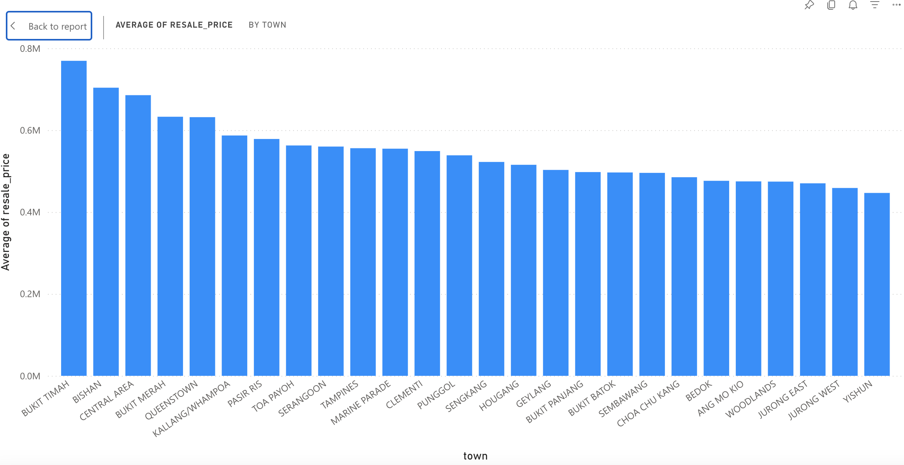
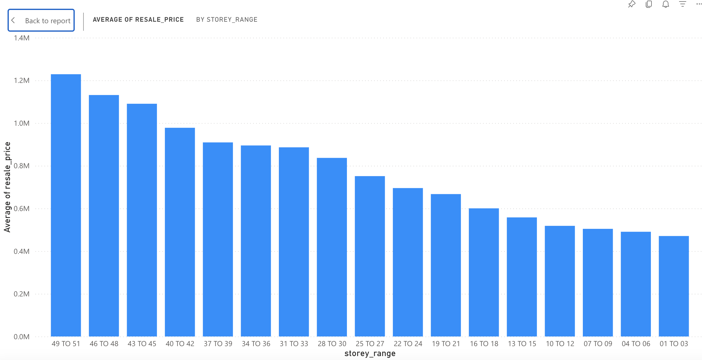
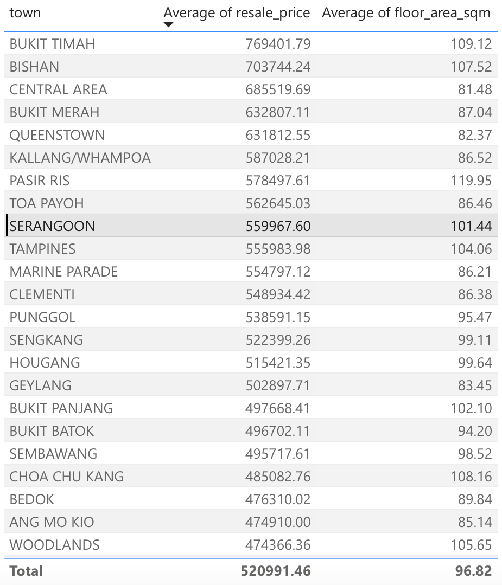

## Singapore HDB Resale Price Analysis

### Overview  
  
This project provides an in-depth analysis of 216,375 HDB resale transactions in Singapore from 2017 to 2025. By leveraging Python and SQL, it explores key factors influencing public housing prices to help potential buyers make informed decisions.  

### Technical Implementation
* ****Languages****: Python, SQL
* ****Libraries****: pandas (Data Manipulation), matplotlib (Static Visualization), sqlite3 (In-memory Database)
* ****Tools****: Jupyter Notebook, Power BI

### Problem Statement
HDB resale prices in Singapore vary significantly based on factors like location, floor level, and flat type.   
This project aims to answer three core questions:

1. Which towns have the highest and lowest average resale prices?
2. How much does the floor level impact the price (the "floor premium")?
3. Which areas offer the best value in terms of price per square meter?

### Data & Methodology

* ****Data Source****: Singapore Government's Open Data
* ****Dataset****: HDB Resale Transactions (Jan 2017 - June 2025), 216,375 records

* ****Methodology****:
  1. Cleaned and performed Exploratory Data Analysis (EDA) using Pandas.
  2. Calculated and visualized average prices by key variables (town, flat type, floor level) with Matplotlib.
  3. Engineered a price_per_sqm metric to analyze value for money across different towns.
  4. Validated Python-based findings by running parallel queries in SQL (via SQLite).
  5. Summarized and presented the key insights in an interactive Power BI dashboard.
 
### Key Findings

* ****Regional Price Disparity****: Bukit Timah is the most expensive town with an average price of $769K, which is 72% higher than Yishun ($447K).
* ****Significant Floor Premium****: Top-floor units (49-51) average $1.23M, making them 2.6 times more expensive than ground-floor units ($471K), confirming that floor level is a major price driver.
* ****Highest Price Per Sqm****: The Central Area commands the highest price per square meter at $8,166/sqm, followed by Queenstown ($7,497/sqm) and Bukit Merah ($7,191/sqm).
* ****Highest-Priced Transaction****: The most expensive flat in the dataset was a 5-room loft unit in Queenstown, sold for $1.66M.

### Visualization Dashboard (Power BI)

[SG_HDB_RESALE - Power BI](https://app.powerbi.com/groups/me/reports/31425555-0594-497b-8f95-94db07df2f21/2567009a889da8942348?experience=power-bi)

The final analysis is summarized in an interactive Power BI dashboard. 

### Repository Structure:

singapore-hdb-analysis/
├── Singapore_HDB_Analysis.ipynb           # Main analysis notebook
├── ResaleflatpricesbasedonregistrationdatefromJan2017onwards.csv  # Dataset
├── images/                                # Visualization images
├── SG_HDB_RESALE.pbix                     # Power BI file
└── README.md                              # Documentation

### How to Run
1. Clone the repository
git clone [repository-url]

2. Install dependencies
pip install pandas matplotlib jupyter

3. Run Jupyter Notebook
jupyter notebook Singapore_HDB_Analysis.ipynb
